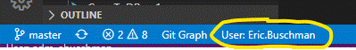

## Features

This extension will display the running user context of the Visual Studio Code editor in the bottom left statusbar

## Requirements

None

## Extension Settings

None

## Known Issues

None

## Release Notes

### 0.0.1

Initial release of active-user

### 0.0.2

Added image showing an example of what the extension does
